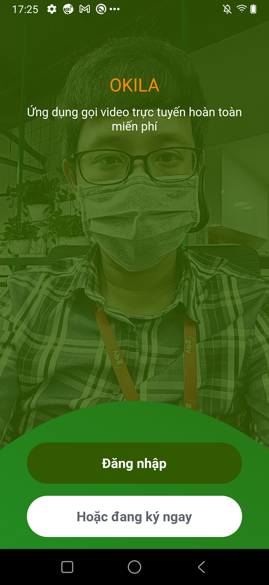

# Flutter-video-calls
Flutter video calls

## [Server](https://github.com/VNAPNIC/kotlin-spring-boot)

### Getting started
Get dependencies and generate necessary files.
```
npm run init
```
We'll handle the generation of required files for 🚀 your onboarding!

### Json parsing / serialization
This project is implementing [json_serializable](https://pub.dev/packages/json_serializable).
It use build_runner to generate files. If you make a change to these files, you need to re-run the generator using build_runner:
```
flutter pub run build_runner build
```
generator using build_runner and remove conflict file :
```
npm run generate
```

## Indentation.
- Auto indentation handled with git hook using [Lefthook](https://github.com/Arkweid/lefthook).
- For mac users, run `npm run setup` and you should be done. More details below.
- This project use npm for [Lefthook](https://github.com/Arkweid/lefthook) installation, to ease others getting it up running fast - run `npm install`
- After installation, run `npx lefthook install` to finish up installation.
- More info [here](https://github.com/Arkweid/lefthook/blob/master/docs/node.md).


   
